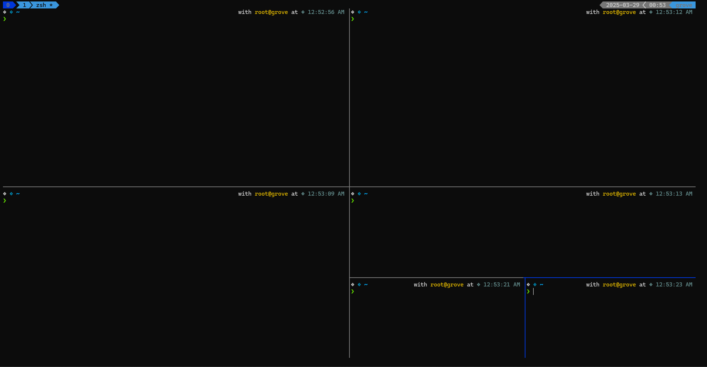

# secsys's Dotfiles

Welcome to my personal collection of dotfiles. These configuration files are tailored to set up and maintain a consistent development environment across various systems.



## Table of Contents
- [✨ Features](#features)
- [⚡ Installation](#installation)
  - [🐧 Linux](#linux)
  - [🪟 Windows](#windows)
- [🚀 Usage](#usage)
- [🎨 Customization](#customization)
- [🔄 Updating](#updating)
- [🤝 Contribution](#contribution)
- [📜 License](#license)


## Introduction

This repository contains configuration files (dotfiles) for various tools and applications I use daily. Managing these dotfiles helps in maintaining a consistent and efficient development environment across different machines.

## ✨ Features
- Easy setup for Linux, macOS, and Windows
- Symbolic link-based configuration management
- Pre-configured settings for Zsh, Tmux, Remote sublime, starship, iterm, aliases and PowerShell ...
- Portable and customizable

## Structure 

```bash
📂 secsys-dotfiles
├── 🐧 linux/
│   ├── ⚙️ zshrc
│   ├── 🎛️ tmux.conf
│   ├── 📂 ...
├── 🍏 mac/
│   ├── ⚙️ zshrc
│   ├── 🎛️ tmux.conf
│   ├── 📂 ...
├── 🪟 windows/
│   ├── 🚀 starship
│   ├── 📝 powershell_profile.ps1
│   ├── 📂 ...
│
└── 📖 README.md
```

## ⚡ Installation

### 🐧 Linux

1. Install necessary dependencies and Oh My Zsh:
   ```sh
   sudo apt install tmux git zsh curl wget xclip -y
   sh -c "$(curl -fsSL https://raw.githubusercontent.com/ohmyzsh/ohmyzsh/master/tools/install.sh)"
   ```

2. Clone this repository:
   ```sh
   git clone https://github.com/s3csys/dotfiles.git ~/.dotfiles
   ```

3. Install Powerlevel10k theme:
   ```sh
   git clone --depth=1 https://github.com/romkatv/powerlevel10k.git ${ZSH_CUSTOM:-$HOME/.oh-my-zsh/custom}/themes/powerlevel10k
   ```

4. Install useful Zsh plugins:
   ```sh
   git clone https://github.com/MichaelAquilina/zsh-you-should-use.git $ZSH_CUSTOM/plugins/you-should-use
   git clone https://github.com/zsh-users/zsh-history-substring-search ${ZSH_CUSTOM:-~/.oh-my-zsh/custom}/plugins/zsh-history-substring-search
   git clone https://github.com/aubreypwd/zsh-plugin-reload.git ${ZSH_CUSTOM:-~/.oh-my-zsh/custom}/plugins/zsh-plugin-reload
   git clone https://github.com/zsh-users/zsh-autosuggestions ${ZSH_CUSTOM:-~/.oh-my-zsh/custom}/plugins/zsh-autosuggestions
   git clone https://github.com/Pilaton/OhMyZsh-full-autoupdate.git ${ZSH_CUSTOM:-~/.oh-my-zsh/custom}/plugins/ohmyzsh-full-autoupdate
   git clone https://github.com/fALKENdk/mylocation.git ${ZSH_CUSTOM:-~/.oh-my-zsh/custom}/plugins/mylocation
   ```

5. Install Tmux Plugin Manager:
   ```sh
   git clone https://github.com/tmux-plugins/tpm ~/.tmux/plugins/tpm
   ```

6. Create symbolic links for configuration files:
   ```sh
   mkdir ~/dotfiles_bak
   for i in $(ls ~/.dotfiles/linux/); do mv ~/.$i ~/dotfiles_bak/ && ln -s ~/.dotfiles/linux/$i ~/.$i; done
   source ~/.zshrc
   ```

7. Add the dotfiles repository to Oh My Zsh plugins:
   ```sh
   ln -s ~/.dotfiles ${ZSH_CUSTOM}/plugins/dotfiles
   ```

8. Reload shell:
   ```sh
   source ~/.zshrc
   ```

9. Pull the tmux plugins prefix key  (ctrl + a)
   ```bash
   prefix + I
   ```

### 🪟 Windows

1. Open PowerShell and check the execution policy:
   ```powershell
   Get-ExecutionPolicy
   ```
   If needed, allow script execution:
   ```powershell
   Set-ExecutionPolicy RemoteSigned -Scope CurrentUser
   ```

2. Run the following commands to create symbolic links:
   ```powershell
   . C:\Users\$env:UserName\.dotfiles\windows\alias.ps1
   New-Item -ItemType SymbolicLink -Path "C:\Users\$env:UserName\OneDrive\Documents\WindowsPowerShell\Microsoft.PowerShell_profile.ps1" -Target "C:\Users\$env:UserName\.dotfiles\windows\Microsoft.PowerShell_profile.ps1"
   ```

3. Create additional symbolic links as needed:
   ```powershell
   New-Item -ItemType SymbolicLink -Path "$env:USERPROFILE\.android" -Target "C:\Users\$env:UserName\.dotfiles\windows\.android"
   New-Item -ItemType SymbolicLink -Path "$env:USERPROFILE\.starship" -Target "C:\Users\$env:UserName\.dotfiles\windows\.starship"
   ```

## 🚀 Usage

### <a href="https://secsys.pages.dev/posts/tmux/" target="_blank">Tmux shortcuts</a>

- **Prefix Key**: Changed from `C-b` to `C-a`

- **Splitting Panes**:
  - Vertical: `C-a -`
  - Horizontal: `C-a |`

- **Creating Panes**:
  - New pane: `C-a c`

- **Switching Panes**:
  - Switch to next pane: `C-a n`
  - Switch to previous pane: `C-a p`
  - Swap with next pane: `C-a >`
  - Swap with previous pane: `C-a <`
  - Select pane by number: `C-a q`
  - Resize pane: `C-a Shift + ↑/↓/←/→`
  - Kill active pane: `C-a x`

- **Pane Management**:
  - Mark pane: `C-a m`
  - Join window: `C-a j`
  - Send pane: `C-a s`
  - Synchronize input to all panes: `C-a S`

- **Window Editing**:
  - Rename window: `C-a ,`
  - Move window: `C-a .`
  - Show all windows: `C-a w`
  - Switch to last active window: `C-a l`
  - Kill window: `C-a &`

- **Session Management**:
  - Create new session: `C-a Shift-S`
  - Detach session: `C-a d`
  - Kill current session: `C-a X`
  - List all sessions: `C-a s`
  - Switch between sessions: `C-a (` (previous), `C-a )` (next)

- **Reload Configurations**:
  - `C-a r` (reload `.tmux.conf`)
  - `C-a R` (reload `.alias.conf`)

- **Toggle Mouse Mode**: `C-a M`
- **Toggle Status Bar**: `C-a B`
- **Toggle Clock Mode**: `C-a t`
- **Toggle Pane Zoom**: `C-a z`

- **Tmux Plugins Shortcuts**:
  - **Tmux Yank**:
    - `C-a [` - Copy to clipboard
    - `C-a ]` - Paste from clipboard
    - `C-a Alt-y` - Paste from history
  - **Tmux Logging**:
    - `C-a P` - Start logging
    - `C-a Alt-P` - Stop logging
    - `C-a Shift-P` - Show log
  - **Tmux Current Pane Hostname**:
    - Displays hostname of the active pane in the status bar

- **Extra Shortcuts for Efficiency**:
  - Scroll Mode (for navigation in panes): `C-a [` → Use Arrow Keys
  - Search in Scroll Mode: `/` (after entering scroll mode)
  - Exit Scroll Mode: `q`
  - Lock Screen (Security): `C-a L`
  - Kill Tmux Server: `C-a K`

More Tmux commands can be found here: <a href="https://secsys.pages.dev/posts/tmux/" target="_blank">Tmux Guide</a>


## 🎨 Customization
You can customize your dotfiles by modifying the files inside `~/.dotfiles`. 

For example, to add new aliases:
```sh
echo 'alias gs="git status"' >> ~/.dotfiles/alias.conf
```
Then, reapply the configuration:
```sh
Prefix + R
```

## 🔄 Updating
Since **OhMyZsh-full-autoupdate** is installed, it will automatically handle updates for Zsh and dotfiles. However, if you need to manually update:
```sh
omz update
```

## 🤝 Contribution
Contributions are welcome! To contribute:
1. **Fork** the repository.
2. **Create a new branch** for your changes.
   ```sh
   git checkout -b feature-branch
   ```
3. **Make your modifications** and commit changes.
   ```sh
   git commit -am "Added new feature"
   ```
4. **Push to your fork** and create a **Pull Request**.
   ```sh
   git push origin feature-branch
   ```

## 📜 License
This repository is open-source and available under the MIT License.

[](LICENSE)